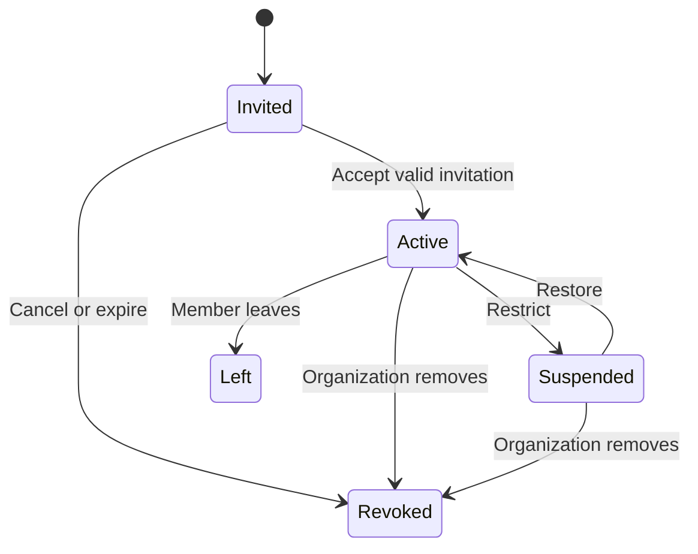

# Authentication and authorization

## Account model

Buyer and seller are non-exclusive capabilities of one account:

- Every active user may act as buyer.
- Seller capability is derived from seller-profile and verification readiness.
- Registration has no buyer/seller selector.
- Dealer capability derives from active membership in a verified organization.
- Dealer membership does not remove personal capabilities.
- Avoid users.account_type and drifting is_seller flags.

## Session design

**Accepted on 2026-07-17 and implemented for backend Phase 1:** short-lived signed access tokens plus opaque rotating refresh sessions.

- Store refresh-token hashes and token-family state server-side.
- Rotate on every refresh and revoke the family on reuse detection.
- Bind sessions to device metadata without relying on unstable hardware identifiers.
- Store mobile refresh material in platform secure storage.
- Support per-session and all-session revocation.
- Require recent authentication/MFA for sensitive admin, verification, and organization-owner actions.
- Access tokens contain stable identity/session references, not mutable dealer permissions.
- Current account, membership, assignment, and resource state are checked server-side.

OIDC/social providers and MFA policy are future decisions.

The implemented API transports access tokens in the `Authorization: Bearer` header and refresh tokens in JSON request/response bodies. It does not use authentication cookies, so cookie CSRF protection is not applicable to these endpoints. Access tokens carry only user, session-family, token, issuer, audience, issued-at, and expiry claims. Defaults are 15 minutes for access tokens and 30 days for refresh families. Argon2id hashes passwords; keyed HMAC-SHA-256 hashes opaque refresh, verification, recovery, invitation, and rate-limit subjects. Only hashes are persisted.

Every refresh consumes the presented row and creates a replacement in the same family. Reuse of a consumed token revokes the complete family. Access-token authentication rechecks current PostgreSQL user and family state, so suspension, logout, logout-all, password change, password recovery, and replay revocation invalidate already-issued access tokens. Device metadata is limited to a user-supplied name and coarse platform.

Email, phone, recovery, and dealer-invitation delivery are provider interfaces with null local adapters. Phase 1 persists expiring single-use challenges and durable outbox events; selecting and operating providers remains unresolved.

## Capabilities

```text
buyer =
  user.status == active

personal_seller =
  user.status == active
  AND seller_profile.status == active
  AND required verification policy passes

dealer_operation =
  user.status == active
  AND organization.status permits operation
  AND membership.status == active
  AND membership grants permission
```

## Listing ownership

Exactly one owner is stored: owner user or dealer organization. created_by_user_id is attribution only.

- Personal listings are managed only by owner user.
- Dealer listings belong to organization.
- Leaving organization revokes access but does not delete listings.
- Organization suspension blocks dealer operations without suspending personal accounts.
- Account suspension removes all capabilities for that identity.
- Owner context is selected per draft/action, not as a security-sensitive global login mode.

Backend Phase 2 enforces these rules in PostgreSQL and application authorization. Personal draft
creation requires the current active user with verified email and phone. Dealer draft operations
re-read the active verified organization and current active membership and require
`organization.inventory.manage`. Reads, updates, location, media, and owner-list queries repeat
object authorization before returning a private projection; membership loss hides organization
resources without deleting them.

## Dealer permissions

| Operation | Owner | Admin | Inventory manager | Sales agent |
|---|---:|---:|---:|---:|
| Organization settings | Yes | Limited | No | No |
| Membership management | Yes | Yes | No | No |
| Create/edit/publish inventory | Yes | Yes | Yes | No |
| View request metadata | Yes | Yes | Optional/TBD | Assigned work |
| Accept/reject interest | Yes | Yes | No | Yes |
| Assign/reassign conversation | Yes | Yes | No | No |
| Read/reply conversation | Only after takeover | Only after takeover | No | Active assignee only |

Inventory-manager request metadata access remains disabled until explicitly approved.

## Object-level authorization matrix

| Action | Required condition |
|---|---|
| React/save/browse | Active user and eligible resource |
| Send interest | Active buyer, not seller/controller, contactable listing |
| Edit personal listing | Owner user and allowed listing state |
| Edit dealer listing | Active member with inventory permission |
| Accept personal interest | Personal listing owner |
| Accept dealer interest | Active member with sales permission |
| Read dealer messages | Active assigned agent with current membership |
| View dealer inbox metadata | Active owner/admin; no bodies/previews |
| Share meetup location | Active conversation participant after match |
| View precise listing point | Explicit backend service or audited investigation purpose |
| Review documents | Purpose-scoped reviewer with case ID |

Return 404 instead of 403 where resource-existence disclosure is unsafe.

Phase 3 Slice 4 submission/readiness requires the current active personal owner and an active,
ready seller profile. `created_by_user_id` never authorizes. Suspension and cross-owner access use
the existing safe not-found boundary. An active dealer operator is authorized before receiving the
stable `DEALER_SUBMISSION_NOT_IMPLEMENTED` response; unrelated callers cannot use that response to
enumerate organization listings.

## Dealer membership lifecycle



Rules:

- Invitation tokens are expiring and single use.
- Organization always retains at least one active owner.
- Owner must transfer ownership before leaving/removal.
- Role or status changes invalidate Redis permission caches and WebSocket access.
- Membership history is append-only.
- Personal resources remain available after organization departure.

## Seller onboarding

1. Active verified email/phone user taps Sell.
2. User selects Personal or an eligible organization context.
3. Backend reports missing seller/profile/verification requirements.
4. User creates a private draft and can resume.
5. Publication revalidates all current capabilities.

Do not place a security-sensitive “current organization” claim in the session. Each organization command includes context and is reauthorized.

## Revocation and caching

PostgreSQL state is authoritative. Redis may cache permission decisions only with short TTL and authorization_version. Membership, assignment, suspension, block, or role events trigger:

1. Transactional state update and outbox event.
2. Immediate cache invalidation.
3. WebSocket revocation publication.
4. Idempotent worker reconciliation.

When cache or revocation infrastructure fails, sensitive dealer messaging and precise-data access fail closed.

## Audit

Audit seller activation/suspension, organization verification/state, membership lifecycle, role changes, listing ownership context, interest decisions, assignments/takeovers, permission denials, document access, precise-location access, and administrative overrides.

Audit records contain actor, membership/organization context, resource, action, structured reason, request/trace ID, timestamp, and redacted change—not documents, secrets, location values, or message bodies.
