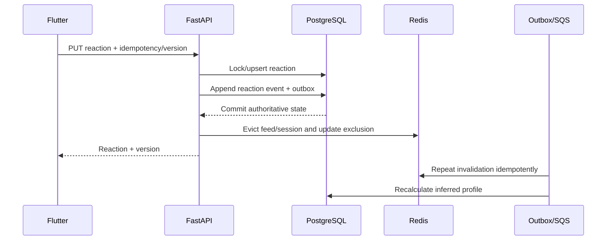

# Discovery and preferences

## Domain rules

- Swipe right upserts Interested.
- Swipe left upserts Not Interested.
- Neutral deletes the current reaction row idempotently.
- Reactions never save a listing, contact a seller, or change a request/match/chat.
- Not Interested is an immediate hard exclusion from normal discovery.
- Interested is a strong positive feature.
- Saved listing is a separate private bookmark with weak recommendation weight.
- Explicit preferences override inferred preferences.

## Reaction transaction



Redis invalidation is synchronous for responsiveness and repeated asynchronously for recovery. Every feed page still applies PostgreSQL exclusions.

## Explicit settings

The Settings area provides:

- Interested listings.
- Not Interested listings.
- Cars or bikes.
- Brands and models.
- Body types.
- Fuel types.
- Transmission.
- Price range.
- Vehicle age.
- Location radius.
- Hidden sellers.
- Reset inferred recommendations.

Typed relational fields are used for searchable preferences. Hidden seller is a discovery preference; block is a safety control.

## Inferred features

Use reactions and bounded behavior:

- Interested make/model/type/price/location affinity.
- Searches and filter use.
- Listing views.
- Capped dwell time.
- Saved listings.
- Explicit seller-contact interaction.

Do not infer from private message content, verification data, phone numbers, precise location, or sensitive documents.

## Candidate generation

Hard-exclude:

- User's own listings.
- Not Interested listings.
- Hidden or blocked sellers.
- Sold, expired, withdrawn, removed, suspended, rejected, or unpublished listings.
- Listings outside explicit distance.
- Canonical duplicates.
- Previously overexposed results.
- Listings failing current owner/verification/publication eligibility.

Explicit filters are constraints when the user selects them. Inferred preferences never expand outside those constraints.

## Deterministic MVP ranking

```text
score =
  0.35 explicit_preference_fit
+ 0.25 interested_similarity
+ 0.15 freshness_and_quality
+ 0.08 search_affinity
+ 0.05 view_affinity
+ 0.04 capped_dwell_affinity
+ 0.04 bookmark_affinity
+ 0.04 seller_interaction_affinity
```

Rules:

- Not Interested has no weight because it is excluded.
- Repeated views/searches have diminishing returns.
- Dwell time is bounded and ignores background intervals.
- Seller interaction transfers only to relevant vehicle features, not global seller favoritism.
- Reserve 10–15% of eligible slots for diversified exploration.
- Version features and weights as ranker-v1.
- Do not introduce machine learning for MVP.

## Feed session and cursor

1. PostgreSQL generates eligible candidates using PostGIS and indexed filters.
2. Ranker scores and diversifies a bounded candidate set.
3. Redis stores a short-lived ordered feed session and current exclusions.
4. Cursor binds session ID, position, ranker version, filter hash, normalized location context, and expiry.
5. Impressions are written asynchronously in idempotent batches.
6. Every page removes newly reacted, blocked, unavailable, or duplicate listings before response.

If Redis fails, use PostgreSQL keyset pagination over stable score/sort keys and the reaction/impression overlay. Correctness is preserved at higher latency.

## Preventing repeated listings

- Unique listing IDs inside a feed session.
- Exclude Not Interested immediately.
- Exclude or strongly cool down recent impressions.
- Cap exposure count per listing/user/window.
- Remove reacted cards from the current prefetched client queue.
- Use canonical vehicle/media fingerprints to suppress duplicate listings.
- Permit an Interested listing to reappear only under a documented revisit policy; default management is through the Interested screen.

## Adaptation targets

- Changed listing exclusion/eligibility: immediate after transaction.
- Similar result reranking: 5–30 seconds.
- Full inferred profile rebuild: within minutes.
- Previous valid inferred profile remains usable on worker failure.

## Reset inferred recommendations

Reset:

1. Increments inference generation.
2. Records inference_reset_at.
3. Invalidates feed and inferred-feature caches.
4. Queues a baseline recomputation.
5. Excludes behavioral events before reset from future inference.

It preserves explicit preferences, current reactions, saved listings, requests, matches, and chats. Current reactions continue to influence ranking until individually changed or removed.

## Reaction management screens

Use opaque cursor pagination by updated_at and reaction ID, bound to filter hash. Support:

- Interested/Not Interested.
- Available/unavailable/all.
- Vehicle type.
- Make/model.
- Most recently changed.

Sold and expired listings remain visible with unavailable status and reaction controls. Privacy/fraud-removed listings use a generic unavailable tombstone without seller, location, media, or description.

## Search and location

- PostgreSQL full-text and trigram search initially.
- PostGIS ST_DWithin and internal exact distance execute server-side.
- Public personal results expose locality and distance bands only.
- Discrete radius options, minimum radius, rate limits, and cursor binding resist spatial probing.
- Results inside a distance band mix relevance/quality rather than exact-distance ordering.
- OpenSearch is a future option only after measured PostgreSQL limits.

## Behavioral privacy

Initial retention:

| Data | Retention |
|---|---|
| Current reactions | Until removal/account deletion subject to legal hold |
| Reaction events | 12 months |
| Raw search/view/dwell events | 90 days |
| Inferred aggregates | 12 months or until reset |
| Security evidence | Separate policy |

Administrative access is audited. User export/deletion processes cover behavioral data. See [security threat model](security-threat-model.md).
