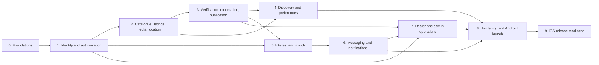

# Implementation roadmap

## Delivery principles

- Build vertical, production-shaped slices in the modular monolith.
- Land database constraints and authorization tests with each feature.
- Keep Android as the release target while running platform-independent Flutter tests.
- Do not begin a phase until its data and security dependencies are stable.
- Use feature flags for incomplete user-facing paths.
- Treat commands as verified only where an implemented manifest or README is linked.

## Dependency graph



## Phase 0 — foundations

**Dependencies:** none.

**Status (2026-07-16):** Backend foundation complete and validated. The Flutter scaffold and mobile CI are not started, so the combined cross-platform phase remains open.

**Deliverables**

- Backend and Flutter scaffolds with committed dependency locks.
- Docker development environment for PostgreSQL/PostGIS and Redis; local SQS/S3 strategy selected.
- Configuration validation, Secrets Manager interface, structured logging, Sentry, trace IDs.
- Alembic baseline, health/readiness endpoints, CI, container build.
- Transactional outbox, idempotency primitive, worker envelope, problem response.
- API schema generation/client strategy.

**Acceptance criteria**

- Empty migration applies to real PostgreSQL/PostGIS.
- API, worker, and mobile tests run in CI.
- No secret values in repository or telemetry.
- Duplicate synthetic event is processed once.
- Container runs non-root and exposes correct health signals.

**Verified backend validation**

```powershell
.\.venv\Scripts\ruff format --check backend
.\.venv\Scripts\ruff check backend
.\.venv\Scripts\mypy --config-file backend\pyproject.toml backend
.\.venv\Scripts\pytest backend\tests\unit
powershell -File backend\scripts\run-integration.ps1 -EnvFile .env
.\.venv\Scripts\python backend\scripts\export_openapi.py --check
docker compose --env-file .env config --quiet
docker compose --env-file .env run --rm migrate
```

Backend evidence: real PostGIS migration and metadata drift check passed; 26 tests passed with 83.71% branch-aware coverage; duplicate SQS delivery produced one consumer marker; API readiness passed; the image ran as UID/GID 10001. Flutter acceptance criteria remain pending.

## Phase 1 — identity and authorization

**Dependencies:** Phase 0.

**Backend status (2026-07-17):** Complete and accepted. Format, lint, strict typing, unit tests, generated OpenAPI, Docker Compose configuration, real PostgreSQL/PostGIS and Redis integration tests, migration, Alembic metadata drift, fresh-image startup, and documented health/readiness behavior passed. The Flutter/mobile portion was intentionally not started, so the combined phase remains open.

**Deliverables**

- Registration, email/phone verification, login, proposed rotating sessions, recovery.
- User/profile/seller-profile state.
- Dealer organizations, membership lifecycle, centralized permission policy.
- Mobile auth bootstrap, secure storage adapter, route guards.
- Audit framework and permission cache invalidation.

**Acceptance criteria**

- No registration account-type selection.
- Suspended account loses personal and dealer capability immediately.
- Leaving dealer preserves personal resources but revokes organization access.
- Owner/admin/member role matrix has object-level tests.
- Refresh replay revokes the session family if proposed session ADR is accepted.

ADR-P01 was accepted on 2026-07-17. The backend implements access-token validation against current user/session state, rotating hashed refresh sessions, family replay revocation, account/profile/seller state, dealer membership lifecycle, centralized authorization, audit/outbox writes, and versioned Redis authorization projections.

Backend acceptance evidence: migration `0002_identity_authorization` is at head with no metadata drift; all 63 backend tests passed against real PostgreSQL/PostGIS and Redis with 82.32% branch-aware coverage; refresh and membership concurrency, authorization-cache behavior, audit/outbox transactions, and OpenAPI drift passed; freshly built API, worker, and outbox-relay containers started successfully; liveness and database/Redis readiness returned healthy responses.

## Phase 2 — catalogue, listings, media, and location

**Dependencies:** Phases 0–1.

**Backend status (2026-07-17):** The requested private-foundation scope is implemented and
accepted. Controlled catalogue/canonical vehicle foundations, personal/dealer private drafts,
typed car/bike specifications, optimistic updates, explicit operating context, private PostGIS
locations, signed current-owner cursors, and private S3/LocalStack quarantine media intent/
completion/status/removal contracts passed acceptance. The Flutter editor and actual media
scan/re-encode/EXIF removal, moderation, derivative/CDN, verification, and publication behavior
were intentionally not started, so the combined phase and the sanitized-derivative criterion
remain open.

Backend evidence: migration `0003_phase2_core` is at head with geography-aware metadata drift
clean; all 72 backend tests passed against real PostgreSQL/PostGIS, Redis, and LocalStack with
82.69% branch-aware coverage; exactly-one-owner, membership loss, audit/outbox atomicity,
optimistic versions, `ST_DWithin`, privacy-safe projections, constrained checksum-bound uploads,
OpenAPI drift, and fresh API/worker/outbox-relay startup passed. The API container reported
healthy.

**Deliverables**

- Controlled vehicle taxonomy and canonical identity foundation.
- Private listing drafts with exactly-one owner constraint.
- Personal/dealer operating-context selector.
- Presigned S3 upload, quarantine, processing worker, derivatives.
- PostGIS location write/filter and privacy-safe response mapper.
- Draft/listing mobile editor and resumability.

**Acceptance criteria**

- Invalid owner combinations fail in PostgreSQL.
- Direct object upload cannot cross listing ownership.
- Sanitized derivatives contain no EXIF/GPS.
- Personal listing contract contains no exact coordinate/address/cell.
- Dealer public pin requires current verified organization address.

## Phase 3 — verification, moderation, publication

**Dependencies:** Phase 2.

**Backend Slice 1 status (2026-07-18):** Media processing evidence and sanitized derivatives
implemented and accepted. Private `media_processing_evidence` and `media_derivatives` tables,
expanded `listing_media` status constraint (`scanning`, `moderation_pending` added), `processed_at`
and `failure_code` columns, lease/claim model, deterministic worker, `ImageSanitizer` with EXIF
stripping and perceptual hashing, three derivative sizes, idempotent duplicate-delivery guard,
atomicity test, and privacy-safe status endpoint implemented and validated.

Backend evidence: migration `0004_phase3_media_processing` is at head with no Alembic metadata
drift; 5 unit tests and 6 integration tests (including duplicate-delivery idempotency, stale-version
rejection, invalid-signature/MIME/checksum rejection, atomicity rollback, and API privacy) passed
against real PostgreSQL/PostGIS, Redis, and LocalStack with exit code 0; targeted Ruff and strict
mypy clean across 19 source files; OpenAPI drift clean. The `PYTEST_CURRENT_TEST` Windows env-var
overflow for binary parametrize IDs was resolved by adding explicit `id=` labels.

**Backend Slice 2 status (2026-07-18):** Provider-neutral user identity-verification attempts and
effective state are implemented and accepted. The slice includes append-only attempt history, one
versioned projection per user, idempotent/concurrent start and resume, a deterministic local/test
adapter, fail-closed non-production-provider configuration, privacy-safe self-service start/status
routes, deterministic result replay/conflict handling, stale-attempt protection, and atomic
attempt/projection/audit/outbox finalization. Capture URLs and provider evidence remain outside
persistence and status/event contracts.

Backend evidence: migration file `0005_phase3_identity_verification.py` is at internal revision
`0005_phase3_identity_verify` (head) with no Alembic metadata drift; 16 focused unit tests and 7
focused integration tests passed against real PostgreSQL with exit code 0; targeted Ruff, strict
mypy, and OpenAPI drift checks passed. One incremental API image build completed. No real provider,
public webhook, documents, owner–vehicle verification, moderation, publication, expiry/revocation
propagation, or Phase 4 behavior was started.

**Backend Slice 3 status (2026-07-18):** Keyed canonical vehicle identity and provider-neutral
personal owner–vehicle verification are implemented and accepted. Active personal owners with a
current verified identity can transiently submit normalized registration plus VIN/chassis
material, resolve/link one versioned canonical vehicle with optimistic listing concurrency, and
idempotently start/resume provider-hosted verification. Append-only ownership attempts bind the
identity projection and keyed material fingerprint; provider result replay/conflict/stale rules,
atomic audit/outbox finalization, private document-reference retention metadata, and privacy-safe
start/status contracts are enforced. Dealer listings remain explicitly unsupported.

Backend evidence: migration `0006_phase3_vehicle_ownership` is at head with no Alembic metadata
drift; 21 focused unit tests and 4 focused real-PostgreSQL integration tests passed with exit code
0; targeted Ruff format/check, strict mypy, and OpenAPI export/drift checks passed. No Docker image
was rebuilt because dependencies were unchanged. A production vehicle normalizer, ownership
provider, and signed result/webhook contract remain undecided and staging/production fail closed.
No publication ownership checks, 180-day reuse policy, revocation propagation, moderation,
publication, later Phase 3 slice, or Phase 4 behavior was started.

**Backend Slice 4 status (2026-07-18):** Personal listing submission and publication-readiness
projection are implemented and accepted. Submission is idempotent, optimistic-version aware,
resumable per listing version, and transactionally records safe gate evidence, audit,
idempotency, and the allowlisted `listing.moderation.requested` outbox event. Readiness is
recomputed from current PostgreSQL account, seller, draft/specification, canonical vehicle,
location, identity, ownership, and media state. Dealer submission remains explicitly unsupported.

Backend evidence: migration `0007_phase3_listing_submit` is at head with no Alembic metadata
drift; 21 focused unit tests and 4 focused real-PostgreSQL integration tests passed with exit code
0; targeted Ruff, strict mypy, and OpenAPI export/drift checks passed. All pre-moderation gates
still produce `publishable=false` and `moderation_pending`; no moderation decision, public URL,
CDN state, discovery eligibility, publication/relisting transition, verification reuse,
revocation propagation, Phase 4, or mobile behavior was started.

**Backend Slice 5 status (2026-07-19):** Reusable personal owner-vehicle verification is
implemented for ownership start/status and listing submission/readiness. The central policy
requires the same active personal owner, canonical vehicle, current identity attempt/projection,
vehicle identity/hash versions, compatible ownership basis, valid fingerprint binding, active
canonical identity state, verified non-conflicting evidence, provider validity, and configurable
freshness. Effective reuse expiry is the earlier of the provider expiry and `verified_at + 180
days`; reuse never updates the source proof timestamps.

Migration `0008_phase3_ownership_reuse` adds canonical vehicle identity state and immutable reuse
selection fields to submission attempts. Reuse start is idempotent and listing-lock serialized;
it creates no provider session or ownership attempt and commits one privacy-safe audit/outbox
result. Submission records the selected original verification and policy version while retaining
Slice 4 moderation behavior and `publishable=false`. Publication-time ownership checks,
moderation decisions, publication/relisting, dealer verification, revocation workers, Phase 4,
and mobile remain unimplemented.


**Deliverables**

- Identity provider adapter and append-only attempts.
- Canonical vehicle HMAC identity and owner–vehicle verification.
- 180-day reusable verification policy (implemented in Slice 5) and publication-time listing
  ownership checks (remaining).
- Moderation cases/decisions and admin review UI/API.
- Publication readiness (implemented in Slice 4) and transactional publish/relist (remaining).
- Revocation/expiry propagation workers and cache invalidation.

**Acceptance criteria**

- Pending/failed verification cannot produce a public URL or discovery result.
- Reused verification creates a new listing-level check without extending expiry.
- Two concurrent publications for one vehicle produce one live listing.
- Revocation immediately removes public eligibility and eventually marks all dependents suspended.
- Material listing edit invalidates prior moderation.

## Phase 4 — discovery and preferences

**Dependencies:** Phases 2–3.

**Deliverables**

- Reactions, reaction history, saved listings, explicit preferences, hidden sellers.
- PostGIS/full-text candidate generation.
- Deterministic ranker-v1 and diversification.
- Redis feed sessions, opaque cursors, impressions, repeat prevention.
- SQS inferred-profile recalculation and reset generation.
- Flutter swipe feed and preference-management screens.

**Acceptance criteria**

- Not Interested disappears immediately, including from prefetched pages.
- Reaction retry is idempotent and no duplicate row exists.
- Neutral does not affect saved/request/match/chat records.
- Explicit filters override inferred features.
- Redis outage preserves correct exclusions through PostgreSQL fallback.
- Cursor reuse with changed filters/location fails safely.

## Phase 5 — interest and match

**Dependencies:** Phases 1 and 3.

**Deliverables**

- Pair-level request thread and two-attempt lifecycle.
- Eligibility, create, reject, withdraw, expiry, accept APIs.
- 24-hour withdrawn and 14-day expired retry cooldowns.
- Unique match/conversation creation on acceptance.
- Mobile confirmation and terminal/cooldown states.

**Acceptance criteria**

- Required partial pending index exists.
- Concurrent create/accept/withdraw/expire tests preserve one valid transition.
- Rejection permanently closes pair.
- Attempt 2 is always final.
- Block/sold/removed closes contact without disclosing block.
- Match and conversation are created in the acceptance transaction.

**Assumption gate:** confirm or replace the proposed seven-day pending expiry before enabling production scheduler.

## Phase 6 — messaging and notifications

**Dependencies:** Phase 5.

**Deliverables**

- Persistent text messages, system events, receipts, history cursors.
- WebSocket ticketing, per-subscription authorization, Redis fan-out, REST recovery.
- Blocks, message reports, spam/rate controls.
- In-app notifications, device tokens, FCM worker, preferences.
- Mobile conversation/reconnect/push navigation.

**Acceptance criteria**

- Message acknowledgement occurs after commit.
- Duplicate client_message_id produces one message.
- Reconnect restores missed history.
- Unauthorized conversation subscription/read/send is denied.
- Push failure does not lose message.
- Private content is absent from default push and logs.

## Phase 7 — dealer assignment, moderation operations, and n8n

**Dependencies:** Phases 3 and 6.

**Deliverables**

- Initial dealer assignment on acceptance.
- Metadata-only organization inbox.
- Assign/reassign/takeover transaction and neutral buyer event.
- Membership-loss unassignment and socket revocation.
- Purpose-limited moderation access.
- Draft n8n workflows for approved asynchronous automations using scoped callbacks.

**Acceptance criteria**

- One active assignment partial index exists.
- Owners/admins cannot read messages before takeover.
- Previous agent loses REST and WebSocket access immediately.
- Unassigned conversations preserve history but prevent seller replies.
- n8n has no production table access and no critical state transition.
- Production workflow activation/execution remains separately approved.

## Phase 8 — security, resilience, and Android launch

**Dependencies:** Phases 4, 6, and 7.

**Deliverables**

- Performance/load tests, query/index review, queue and WebSocket sizing.
- WAF/rate-limit policies, external security assessment, privacy review.
- Backup/PITR and restore drill; DLQ replay drill.
- SLO dashboards, synthetic journeys, operational runbooks.
- Android signing, store privacy/data-safety declarations, staged rollout.

**Acceptance criteria**

- Critical SLO assumptions validated or revised from load evidence.
- No high/critical security findings open.
- Restore meets approved RPO/RTO.
- End-to-end verified journey passes in staging.
- Canary rollback and incident response are rehearsed.
- Release telemetry and alerts are live before rollout.

## Phase 9 — iOS readiness

**Dependencies:** stable Android production baseline.

- Configure APNs through FCM, iOS signing, permissions, universal links, privacy manifest, and store review.
- Run iOS device/integration/accessibility tests on macOS CI.
- Resolve platform differences through adapters, not feature forks.

## Recommended implementation order

Within each phase:

1. Migration and database constraints.
2. Domain state/policy tests.
3. Application transaction and repositories.
4. API contract and authorization tests.
5. Worker/outbox behavior.
6. Flutter repository/controller/UI.
7. End-to-end and observability.
8. Feature flag activation.

Stop a phase when its acceptance criteria pass. Do not broaden into future infrastructure or unconfirmed features.
