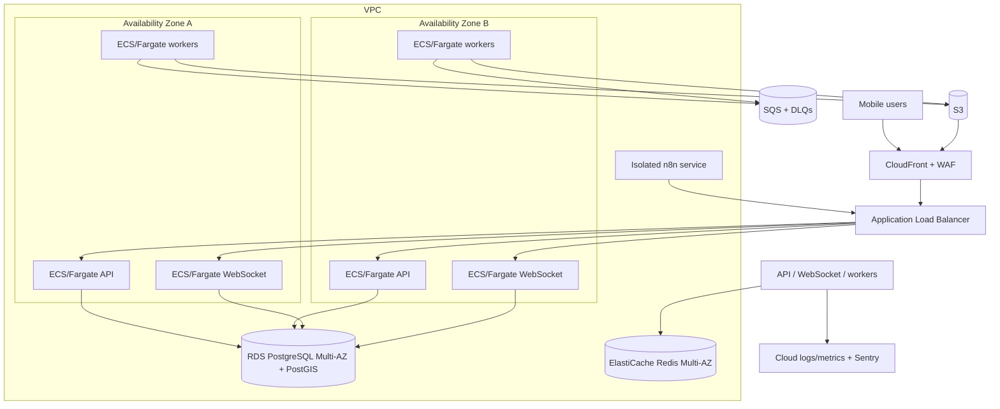

# Infrastructure and deployment

## AWS MVP topology

Use managed services and containers; do not introduce Kubernetes.

n8n runs in a separate security boundary and application database. It reaches only scoped internal API endpoints and approved providers.

## AWS services

| Need | MVP service |
|---|---|
| Containers | ECS on Fargate |
| Registry | ECR with immutable tags and scanning |
| Edge | Route 53, CloudFront, WAF, ALB |
| Database | RDS PostgreSQL Multi-AZ with PostGIS and PITR |
| Cache | ElastiCache Redis Multi-AZ |
| Queue | SQS standard queues with per-job DLQs |
| Media | S3, KMS, CloudFront origin access control |
| Secrets | Secrets Manager and KMS |
| Push | FCM called by worker |
| Telemetry | CloudWatch-compatible logs/metrics plus Sentry |
| Automation | n8n container/service with separate database and encryption key |

Exact DNS, accounts, regions, and IaC tool are future decisions.

## Network boundaries

- Public ingress only through CloudFront/ALB.
- API/WebSocket tasks in private subnets where practical.
- RDS and Redis never public.
- Security groups grant least-privilege service-to-service access.
- Workers use VPC endpoints for S3, SQS, ECR, Secrets Manager, and logs when cost/region supports it.
- n8n egress is allowlisted; inbound callbacks use scoped authentication.
- Admin access uses SSO/VPN or an approved zero-trust path, not direct database exposure.

## Environments

Use separate AWS accounts or strongly isolated projects for development, staging, and production. Separate:

- Databases, queues, buckets, Redis, n8n, secrets, KMS keys, FCM projects, and telemetry.
- Domains and callback URLs.
- Provider sandbox/production credentials.
- Retention and sampling policies.

No production data is copied into lower environments without irreversible sanitization.

## Container and release strategy

- Multi-stage builds, non-root runtime, read-only filesystem where possible.
- Pin base images by digest and generate SBOM.
- Scan dependencies, source, IaC, and images before deployment.
- Health probes: /health/live and /health/ready; WebSocket has a separate readiness signal.
- Rolling or blue/green deployment with automatic rollback on health/SLO regression.
- Migration task runs once before compatible application rollout.
- Database changes use expand → backfill → switch → contract.
- Feature flags guard risky behavior changes, not authorization bypass.

## CI/CD gates

Planned pipeline:

1. Format, lint, type check, unit tests.
2. Migration and generated SQL review.
3. Integration tests with PostgreSQL/PostGIS, Redis, SQS emulator or AWS test resources, and S3-compatible test storage.
4. Mobile widget/integration tests and Android release build.
5. Secret, SAST, dependency, license, and container scans.
6. Build/sign/push immutable images.
7. Deploy staging; run smoke and contract tests.
8. Manual production approval.
9. Deploy canary/blue-green.
10. Verify telemetry and rollback readiness.

The repository currently has no manifests; commands are documented in [observability and testing](observability-testing.md) as planned gates.

## Scaling

Scale based on measured latency, queue age, connection count, CPU/memory, and database saturation:

- API tasks by request concurrency/latency.
- WebSocket tasks by active connections and event-loop lag.
- Workers by queue depth and oldest-message age.
- Outbox relay by unpublished-event age.
- Redis with cluster/read capacity only when measured.
- PostgreSQL with query/index tuning first, then read replicas for eligible reads.
- Partition messages, audit logs, outbox, impressions, and behavioral events when size/maintenance evidence justifies it.

Do not add Kafka or OpenSearch in MVP.

## Backup and disaster recovery

- RDS automated backups, PITR, Multi-AZ, and periodic cross-region snapshots.
- S3 versioning and lifecycle; cross-region replication only for required data classes.
- Encrypted export/version control of n8n workflow definitions without credentials.
- Secrets and KMS recovery procedures.
- Quarterly restore drills covering database, media metadata, and critical configuration.
- Documented queue replay and idempotency procedure.

**Assumption:** initial target RPO 15 minutes and RTO 4 hours. Product/compliance must confirm before launch.

## Cost and operational controls

- Separate worker queues prevent expensive media jobs from starving notifications.
- Set task CPU/memory and request/body limits.
- S3 lifecycle deletes abandoned uploads and transitions retained media appropriately.
- Telemetry sampling and retention are data-class aware.
- Budget alerts and anomalous egress detection are mandatory.
