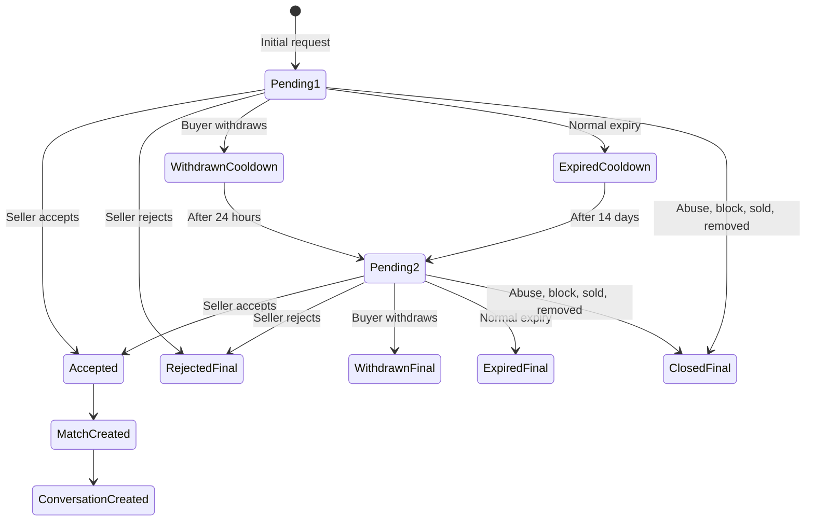
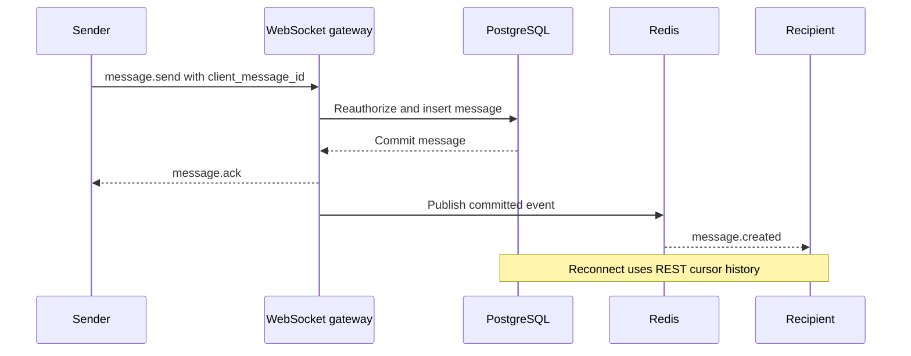

# Interest, match, and chat flow

## Request policy

- Maximum two request records per buyer/listing thread.
- Attempt 1 may be withdrawn while pending.
- Attempt 1 withdrawal consumes the only retry and unlocks attempt 2 after 24 hours.
- Attempt 1 normal expiry unlocks attempt 2 after 14 days.
- Any rejection is permanently final.
- Attempt 2 is final after acceptance, rejection, withdrawal, or expiry.
- Abuse rejection, blocking, sold listing, or removed listing permanently closes the thread.
- No reactivation or withdrawal undo.
- **Assumption:** pending requests expire after seven days; this value remains configurable and unconfirmed.

## State machine



The pair-level interest_request_thread is the locking and lifecycle boundary. See [database design](database-design.md) for constraints.

## Eligibility response

```json
{
  "can_send": false,
  "lifecycle_state": "withdrawn_cooldown",
  "attempts_used": 1,
  "maximum_attempts": 2,
  "next_attempt_number": 2,
  "retry_remaining": 1,
  "next_retry_at": "UTC timestamp",
  "reason_code": "RETRY_COOLDOWN_ACTIVE",
  "message_key": "interest.withdrawn_retry_cooldown"
}
```

The endpoint is advisory; create/retry revalidates transactionally.

## Create or retry transaction

1. Validate idempotency key and request hash.
2. Lock listing.
3. Create the thread with ON CONFLICT DO NOTHING when absent.
4. Lock thread and latest request.
5. Recheck listing contactability, self-contact, blocks, permanent closure, active request, attempt count, predecessor status, and cooldown.
6. Insert attempt with attempt_number and previous_request_id.
7. Update thread attempt_count/latest_request_id.
8. Insert audit and outbox events.
9. Commit.

Lock order is listing → thread → latest request.

## Acceptance transaction

1. Lock listing, thread, and pending request.
2. Verify personal owner or dealer member with active sales permission.
3. Recheck listing availability and blocks.
4. Mark accepted and permanently close thread.
5. Insert unique match.
6. Insert conversation and members.
7. For dealer listing, insert initial active assignment to accepting member.
8. Insert neutral system event, audit records, and outbox events.
9. Commit.

Match and conversation creation are not asynchronous.

## Withdrawal UX

Attempt 1 confirmation:

> Withdraw this request? You can send one final request after 24 hours. Withdrawal cannot be undone.

Attempt 2 confirmation:

> This is your final request. Withdrawing it permanently removes the option to contact this seller about this listing.

The mobile client waits for the server result. It provides no Undo or Reactivate action.

## Failure codes

| Code | Meaning |
|---|---|
| ACTIVE_REQUEST_EXISTS | Pending request already exists |
| RETRY_COOLDOWN_ACTIVE | Attempt 2 is available later |
| REQUEST_REJECTED_FINAL | Seller rejection closed the pair |
| MAX_REQUEST_ATTEMPTS_REACHED | Final attempt was used |
| WITHDRAWAL_NOT_ALLOWED | Request is no longer pending |
| REQUEST_STATE_CHANGED | Concurrent transition won |
| THREAD_ALREADY_ACCEPTED | Match/conversation already exists |
| LISTING_UNAVAILABLE | Listing cannot be contacted |
| CONTACT_UNAVAILABLE | Public response for block/abuse restriction |
| IDEMPOTENCY_KEY_CONFLICT | Key reused with different payload |

Use 409 for lifecycle conflicts and 429 only for actual throttling.

## Conversation authorization

Personal seller conversation access belongs to the owning user. Dealer conversations follow assignment:

- One active assigned sales agent when ASSIGNED.
- Zero active assignments when UNASSIGNED.
- Accepting member is initial assignee.
- Only active assignee reads full history or sends seller messages.
- Owners/admins see metadata and may explicitly assign, reassign, or take over.
- Takeover changes the assignee before history access.
- Other and historical agents have no message-body access.
- Platform moderation access is case-scoped, purpose-limited, and audited.

## Dealer assignment transaction

1. Lock conversation and active assignment.
2. Lock target membership.
3. Verify actor owner/admin, active organization, target membership, and sales permission.
4. End prior assignment.
5. Insert new assignment.
6. Set assignment_state assigned and increment authorization_version.
7. Add neutral buyer-visible event: “Your dealership contact has changed.”
8. Insert audit and outbox events.
9. Commit.

Membership loss ends access immediately. Materialized unassignment may be processed in bounded batches, but authorization checks current membership on every read/send.

## WebSocket delivery



Reassignment increments authorization_version, invalidates Redis authorization cache, and publishes socket revocation. Redis is not authoritative.

## Messaging controls

- Persistent messages and append-only system events.
- Cursor history and monotonic read receipts.
- Per-user/conversation/device/IP limits.
- Spam heuristics and report-message action.
- Blocking prevents new contact and applies conversation policy.
- Phone numbers are not exposed by default.
- **Assumption:** MVP supports text and system events only; attachments require a later threat-modelled design.
- Push fallback includes no private message body by default.

## Unassigned and suspended states

- Unassigned conversation is preserved; buyer messages may persist, but no dealer user can read or reply until assignment.
- Owners/admins see waiting/unread/escalation metadata without previews.
- Organization suspension makes conversations read-only according to moderation policy.
- Reinstatement uses current membership and assignment state, not historical access.
