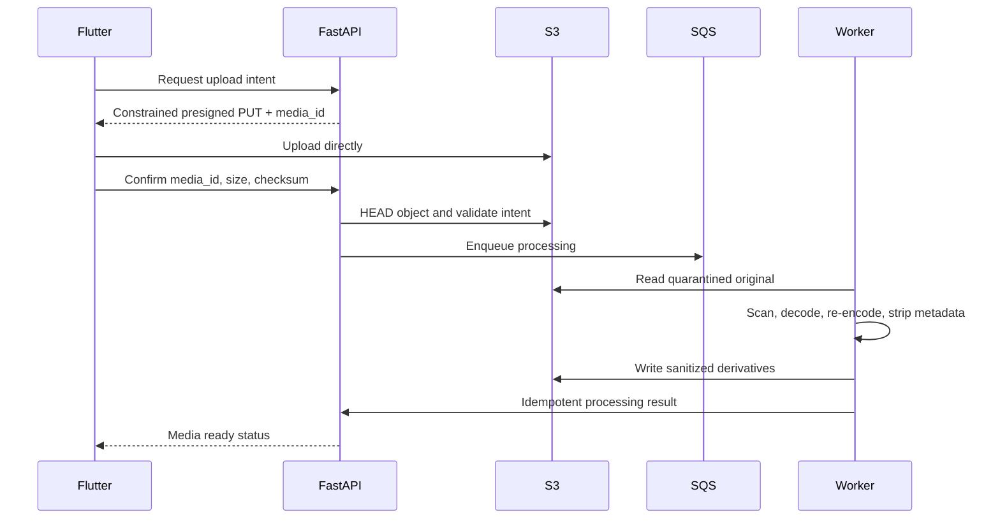

# Media storage

## Storage layout

Use S3 with separate security boundaries:

- quarantine originals: private, never served through CDN.
- sanitized derivatives: private origin behind CloudFront.
- verification documents: separate bucket/account boundary and KMS key.
- temporary processing output: short lifecycle and no public access.

Object keys are generated server-side and contain opaque IDs, not user email, phone, registration number, address, or original filename.

## Upload flow

The API never proxies normal upload bytes.

## Upload intent constraints

An intent binds:

- Authenticated owner and listing draft.
- Generated object key and media ID.
- Expected MIME allowlist and extension.
- Maximum bytes and image dimensions.
- Expected checksum where supported.
- Single use and short expiry.
- Maximum media count and remaining quota.

Completion rejects missing, oversized, mismatched, expired, or already-consumed objects.

## Processing pipeline

1. Quarantine object.
2. Verify object size/checksum and file signature.
3. Validate declared MIME and extension independently.
4. Scan for malware.
5. Decode using a resource-limited image library.
6. Reject decompression bombs and malformed content.
7. Apply orientation.
8. Re-encode to approved formats and dimensions.
9. Strip EXIF, GPS, XMP, IPTC, comments, embedded thumbnails, and unknown chunks.
10. Generate responsive derivatives and thumbnail.
11. Compute SHA-256 and perceptual hash.
12. Run content/duplicate moderation on sanitized derivative.
13. Mark ready and make derivative addressable through CDN.
14. Delete/quarantine original under retention policy.

Publication requires all selected media to be ready and moderation-approved for the current listing version.

## Access and CDN

- S3 Block Public Access enabled.
- CloudFront origin access control for derivatives.
- Immutable versioned derivative keys with long cache lifetime.
- Listing API returns CDN references only for currently visible media.
- Removed/suspended listing invalidates public API visibility immediately; CDN invalidation or short authorization TTL handles residual cache.
- Private drafts use short-lived signed delivery or authenticated image proxy policy.
- Never return original object keys or presigned upload URLs to logs/analytics.

## Authorization

Only listing owners or authorized dealer inventory members may create/delete/reorder draft media. Media IDs are always checked against listing ownership and state to prevent IDOR.

Workers use a narrow IAM role for required prefixes. Moderation providers receive sanitized derivatives unless original access is separately approved and audited.

## Failure recovery

- Processing states: uploaded, scanning, processing, moderation_pending, ready, rejected, failed.
- Jobs use media_id + processing_version as idempotency key.
- Transient failures retry with bounded backoff; permanent decode/MIME failures do not.
- DLQ retains object/media references and safe error code.
- Reconciliation finds uploaded objects without completion, stuck jobs, derivatives without records, and orphaned objects.
- Lifecycle rules delete abandoned uploads and temporary results.

## Vehicle documents

Ownership and identity evidence are not listing media. They use the isolated verification path in [verification and moderation](verification-moderation.md). They never receive a CloudFront URL.

## Mobile requirements

- Compress only for UX/bandwidth; server validation remains authoritative.
- Upload concurrently with a small bounded pool.
- Preserve resumable server draft and per-media state.
- Retry with a new upload intent only after the server invalidates the old one.
- Do not store verification documents or presigned URLs in analytics, crash logs, or unencrypted caches.
