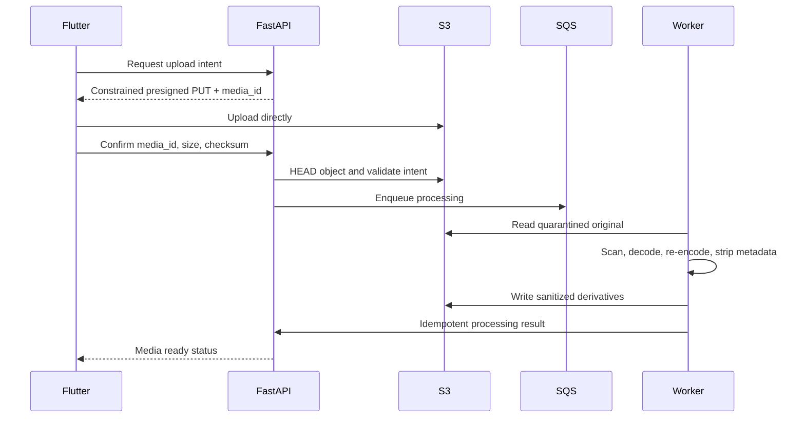

# Media storage

## Storage layout

Use S3 with separate security boundaries:

- quarantine originals: private, never served through CDN.
- sanitized derivatives: private origin behind CloudFront.
- verification documents: separate bucket/account boundary and KMS key.
- temporary processing output: short lifecycle and no public access.

Object keys are generated server-side and contain opaque IDs, not user email, phone, registration number, address, or original filename.

## Upload flow

The API never proxies normal upload bytes.

### Implemented backend Phase 2 boundary

Phase 2 implements private S3/LocalStack quarantine intents, HEAD-based completion, status, and
removal contracts. Backend-generated opaque keys are bound to the authorized draft/media row;
declared MIME, byte size, SHA-256 checksum, count, order, single-use state, and expiry are
validated. Presigned URLs are returned only to the caller and are not persisted in API state,
audit, outbox payloads, or logs. Completion performs S3 I/O before opening the mutation
transaction and emits `media.processing.requested` with allowlisted identifiers only.

Backend Phase 3 Slice 1 consumes that event and implements malware-scanner orchestration,
decode/re-encode, derivative generation, metadata stripping, and versioned processing evidence.
Content moderation decisions, CDN delivery, and publication readiness remain unimplemented. A
Phase 2 `processing` state is only a durable work request and does not imply sanitization or
publishability.

### Implemented backend Phase 3 Slice 1 boundary

Workers claim `media_id + processing_version` in a short transaction. S3 reads, scanner calls,
Pillow decoding, re-encoding, and private derivative writes occur outside database transactions.
Final media state, versioned evidence, derivative rows, redacted audit, and an allowlisted outbox
event commit together. Duplicate deliveries cannot create duplicate derivative rows; stale
versions and removed media cannot overwrite current state.

Inputs are limited by bytes, dimensions, and decoded pixels; signatures, stored MIME, stored size,
expected SHA-256, and any S3 SHA-256 are checked before decode. JPEG, PNG, and WebP are accepted;
orientation is applied and new RGB JPEG pixel buffers are encoded at thumbnail, medium, and large
bounds without EXIF, GPS, XMP, IPTC, comments, embedded thumbnails, ICC profiles, or unknown input
chunks. Evidence records the sanitized SHA-256 and `ahash64-v1`-compatible perceptual hash.

Derivative keys are generated only by the backend under versioned private prefixes. No original
or derivative key, URL, checksum, perceptual hash, embedded metadata, or scanner detail is returned
by the status API or emitted in events. Quarantine originals remain subject to the existing short
lifecycle policy; this slice does not introduce immediate deletion or public/CDN delivery.

The disabled/no-op and deterministic scanner adapters are development/test-only. Configuration
fails closed in staging and production because no production malware provider is selected.

## Upload intent constraints

An intent binds:

- Authenticated owner and listing draft.
- Generated object key and media ID.
- Expected MIME allowlist and extension.
- Maximum bytes and image dimensions.
- Expected checksum where supported.
- Single use and short expiry.
- Maximum media count and remaining quota.

Completion rejects missing, oversized, mismatched, expired, or already-consumed objects.

## Processing pipeline

1. Quarantine object.
2. Verify object size/checksum and file signature.
3. Validate declared MIME and extension independently.
4. Scan for malware.
5. Decode using a resource-limited image library.
6. Reject decompression bombs and malformed content.
7. Apply orientation.
8. Re-encode to approved formats and dimensions.
9. Strip EXIF, GPS, XMP, IPTC, comments, embedded thumbnails, and unknown chunks.
10. Generate responsive derivatives and thumbnail.
11. Compute SHA-256 and perceptual hash.
12. Mark `moderation_pending` after private sanitization evidence commits. **Implemented Slice 1.**
13. Run content/duplicate moderation on sanitized derivative. **Not implemented.**
14. Mark ready and make derivative addressable through CDN. **Not implemented.**
15. Delete/quarantine original under retention policy.

Publication requires all selected media to be ready and moderation-approved for the current listing version.

## Access and CDN

- S3 Block Public Access enabled.
- CloudFront origin access control for derivatives.
- Immutable versioned derivative keys with long cache lifetime.
- Listing API returns CDN references only for currently visible media.
- Removed/suspended listing invalidates public API visibility immediately; CDN invalidation or short authorization TTL handles residual cache.
- Private drafts use short-lived signed delivery or authenticated image proxy policy.
- Never return original object keys or presigned upload URLs to logs/analytics.

## Authorization

Only listing owners or authorized dealer inventory members may create/delete/reorder draft media. Media IDs are always checked against listing ownership and state to prevent IDOR.

Workers use a narrow IAM role for required prefixes. Moderation providers receive sanitized derivatives unless original access is separately approved and audited.

## Failure recovery

- Processing states implemented through Slice 1: intent_created, processing, scanning,
  moderation_pending, rejected, failed, expired, removed.
- Jobs use media_id + processing_version as idempotency key.
- Active claims use bounded leases; transient failures retry and terminal invalid inputs do not.
- `moderation_pending` means sanitization completed, not moderation approval or public eligibility.
- DLQ retains object/media references and safe error code.
- Reconciliation finds uploaded objects without completion, stuck jobs, derivatives without records, and orphaned objects.
- Lifecycle rules delete abandoned uploads and temporary results.

## Vehicle documents

Ownership and identity evidence are not listing media. They use the isolated verification path in [verification and moderation](verification-moderation.md). They never receive a CloudFront URL.

## Mobile requirements

- Compress only for UX/bandwidth; server validation remains authoritative.
- Upload concurrently with a small bounded pool.
- Preserve resumable server draft and per-media state.
- Retry with a new upload intent only after the server invalidates the old one.
- Do not store verification documents or presigned URLs in analytics, crash logs, or unencrypted caches.
