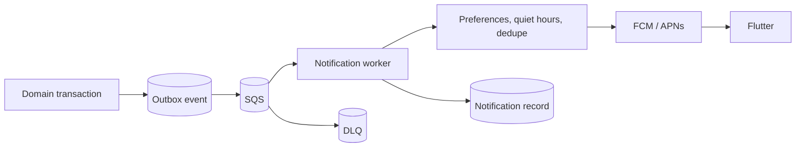

# Notifications and n8n

## Notification architecture

Core services create notification intents through the transactional outbox. SQS workers claim intents, enforce preferences and rate limits, send through FCM, and record delivery state.

Push is a hint. In-app notification and conversation state remain available through REST.

## Notification controls

- Per-category/channel preferences.
- Quiet hours and locale-aware templates.
- Device-token rotation and revocation.
- Per-user, listing, request, and category rate limits.
- Stable dedupe key: event_id + recipient_id + channel + template_version.
- No private coordinates, verification details, phone numbers, secrets, or document data.
- Chat push omits message bodies by default.
- Delivery failures do not roll back domain transactions.

MVP categories include seller interest request, accepted/rejected request, assignment/contact change, new message fallback, listing verification/moderation state, listing expiry/reminder, price/saved-filter alert, and security/session event.

Saved-search delivery cadence is a future product decision.

## n8n boundary

n8n is isolated automation, not a domain runtime.

Allowed:

- External moderation/verification orchestration.
- Admin/manual-review alerts.
- Seller reminders and stale-listing outreach.
- Notification channel integrations not owned by core FCM worker.
- Dealer CRM lead routing.
- Sanitized analytics synchronization.
- Operational reports and escalation.

Forbidden:

- Authentication/session decisions.
- Reaction persistence, feed ranking, or cache correctness.
- Interest eligibility, expiry transition, acceptance, match or conversation creation.
- Message persistence/delivery authorization.
- Listing creation/publication or verification reuse decisions.
- Direct writes to production application tables.
- Access to precise personal coordinates or raw documents.

n8n uses scoped service credentials and signed, versioned events. It calls controlled internal APIs; PostgreSQL remains behind FastAPI.

## Planned workflows

| Workflow | Trigger | Backend authority | Idempotency and failure |
|---|---|---|---|
| New listing moderation | listing.moderation_requested | Backend validates and records result | event/listing/version key; pending on failure |
| Seller verification orchestration | verification.submitted/provider callback | Backend owns status transitions | provider event/reference; manual review fallback |
| Buyer interest notification | interest_request.created | Backend claims notification intent/preferences | notification intent/channel key; DLQ |
| Stale listing reminder | Daily schedule | Backend returns claimed bounded batch and expires transactionally | listing/policy/due-date key |
| Price-drop alert | listing.price_changed | Backend selects eligible saved/interested users | user/listing/price-history/channel key |
| Suspicious activity alert | risk.review_requested | Backend recomputes risk and creates case | subject/window/model key |
| Dealer lead routing | interest_request.qualified | Backend validates consent and field allowlist | stable lead external ID |
| Analytics synchronization | analytics.batch_ready | Backend supplies sanitized allowlisted batch | analytics event ID |
| Shared error handler | Error Trigger | Backend records durable automation failure | workflow/execution/stage key |

## Workflow construction requirements

For every workflow:

1. Inspect the current n8n workflow, draft/active versions, nodes, credentials metadata, triggers, and downstream contracts through MCP.
2. Read the n8n SDK reference and best practices.
3. Search and retrieve exact node definitions; do not assume integrations exist.
4. Validate each node before graph mutation and validate the final graph.
5. Connect default/error branches.
6. Set explicit provider and workflow timeouts.
7. Retry transient 408/429/5xx failures only with bounded backoff.
8. Send exhausted work to a backend-owned durable dead-letter path.
9. Disable or minimize stored execution data for sensitive flows.
10. Keep production triggers unpublished/inactive until explicitly approved.

The repository does not confirm current n8n credentials or production activation. Inspect live state at execution time; never put credential values or private endpoints in documentation.

## Event and callback security

- Signed event JWT or HMAC with audience, issuer, expiry, event ID, and payload digest.
- Replay table/idempotency in backend.
- Separate credential per workflow class where practical.
- Egress allowlist and SSRF protections.
- Internal response schemas contain no unnecessary PII.
- Callback authorization scopes match the exact command.
- All automation executions correlate event ID, n8n execution ID, stage, trace, and safe outcome.

## Failure handling

n8n/provider outage delays automation but does not corrupt core state. Outbox delivery retries; n8n callbacks are idempotent; DLQ backlog alerts operations. Core API must never wait synchronously for n8n.

Use the repository [n8n workflow skill](../.codex/skills/n8n-workflow/SKILL.md) for future workflow changes.
