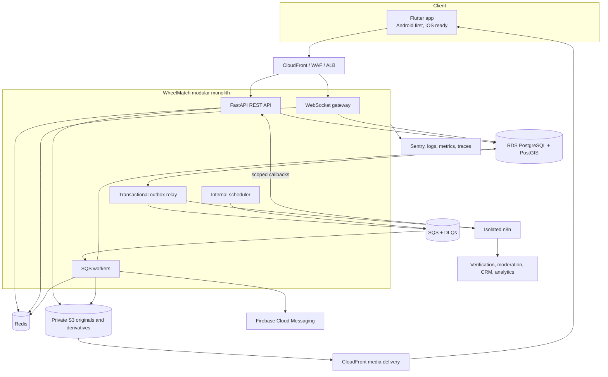

# System architecture

## Architecture style

WheelMatch starts as a modular FastAPI monolith. It is deployed as multiple runtime roles from one codebase—API, WebSocket gateway, background worker, scheduler, and outbox relay—without splitting domain ownership into network services.



## Responsibilities

| Component | Owns |
|---|---|
| Flutter | Presentation, local interaction state, secure session material, offline-safe command retry |
| FastAPI | Authorization, validation, transactions, domain invariants, public/internal APIs |
| PostgreSQL/PostGIS | Authoritative state, spatial queries, outbox, idempotency and audit |
| Redis | Cache, distributed limits, feed sessions, presence, WebSocket fan-out and revocation hints |
| SQS | Durable asynchronous work, bounded retries, DLQs |
| S3/CloudFront | Quarantined uploads, sanitized derivatives, controlled media delivery |
| WebSockets | Live message/events after database commit; never message source of truth |
| FCM | Push transport and offline chat notification |
| n8n | Non-critical reminders, integrations, moderation orchestration, reporting |
| Sentry/telemetry | Redacted error, log, metric, and trace data |

## Synchronous command path

1. Edge rate limits and authenticates transport.
2. FastAPI validates schema and object-level permission.
3. Domain service locks required rows in a documented order.
4. Domain rows, audit data, idempotency result, and outbox event commit together.
5. API returns the authoritative resource state.
6. Relay publishes the outbox event to SQS or the isolated n8n gateway.
7. Consumers are idempotent and update projections or deliveries.

No client-visible success is returned before the authoritative transaction commits.

## Event envelope

All asynchronous events use a versioned minimal envelope:

```json
{
  "event_id": "uuidv7",
  "event_type": "listing.reaction_changed",
  "schema_version": 1,
  "aggregate_type": "listing",
  "aggregate_id": "uuid",
  "occurred_at": "UTC timestamp",
  "traceparent": "W3C trace context",
  "payload": {}
}
```

Payloads contain identifiers and non-sensitive derived fields, not private coordinates, document content, phone numbers, private chat, or secrets.

## Reliability model

- **Transactional outbox:** prevents database/event dual-write loss.
- **Idempotent consumers:** unique consumer/event keys make redelivery safe.
- **Retries:** exponential backoff with jitter for transient failures only.
- **DLQs:** store event references and redacted failure codes; replay is controlled.
- **Circuit breakers:** provider adapters fail fast during sustained outages.
- **Graceful degradation:** discovery falls back to PostgreSQL when Redis is unavailable; notifications and n8n can lag without corrupting core state.
- **Fail closed:** authorization, verification, precise-location access, and dealer messaging fail closed.
- **Health endpoints:** liveness is process-only; readiness checks required dependencies with strict timeouts.

## Scaling without premature services

Scale API, WebSocket, workers, and relay independently. Add PostgreSQL read replicas for safe read workloads, partition append-heavy tables when measured, and introduce OpenSearch only when PostgreSQL search evidence justifies it.

Future extraction candidates are Messaging, Media Processing, Search, Notifications, and Recommendation computation. Extraction requires a demonstrated independent scaling or ownership need; module boundaries and outbox contracts prepare for it.

Deployment details are in [infrastructure and deployment](infrastructure-deployment.md), and module boundaries are in [backend architecture](backend-architecture.md).
