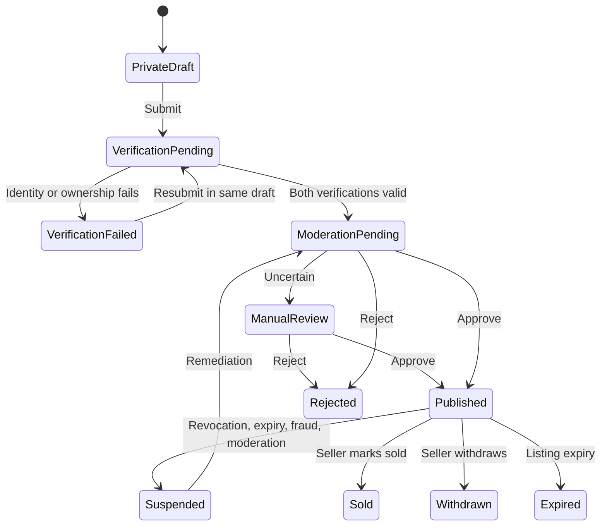

# Verification and moderation

## Publication gates

Users may create private drafts after email and phone verification. Personal listings become public only after current identity verification, owner–vehicle verification, media readiness, and moderation approval all pass.

Use separate lifecycle_status, publication_status, and moderation_status. A listing is publicly eligible only when all source predicates remain valid; published status alone is insufficient.

## Identity verification

Identity verification is user-level and reusable until expired, revoked, or materially changed.

Phase 3 Slice 2 implements append-only `identity_verifications` attempt rows and one versioned
`user_verification_states` effective projection per user. States are `session_pending`, `pending`,
`manual_review`, `verified`, `failed`, `expired`, and `revoked`; expiry and revocation propagation
remain later-slice behavior. Provider session creation is idempotent and outside database
transactions. A unique provider result ID makes duplicate delivery harmless, while terminal
conflicts fail safely and superseded attempts cannot overwrite a newer projection.

Provider-hosted capture is the only active collection path. Capture URLs are returned once to the
authenticated caller and never stored, logged, audited, or emitted. Provider references remain
persistence-only. Result finalization commits the attempt, effective projection version, redacted
audit entry, and allowlisted outbox event together. No public callback exists until a production
provider and signature contract are accepted.

Material legal-name, birth-date, identity-document, fraud, or assurance-policy changes require reverification.

## Canonical vehicle identity

canonical_vehicles binds listings and ownership evidence to one vehicle identity.

- Normalize identifiers by jurisdiction.
- Use keyed HMAC, not plain hashes, for registration and VIN/chassis identifiers.

Phase 3 Slice 3 implements the personal-listing boundary. Registration plus VIN/chassis values
exist only in request-local normalization memory; `canonical_vehicles` stores versioned keyed
HMAC-SHA256 values. An active personal owner with a current verified, unexpired, non-revoked
identity can link the canonical vehicle using the listing's optimistic version and start or resume
one unresolved ownership attempt. Dealer listings remain unsupported in this slice.

Ownership attempts transition `session_pending -> pending|failed` and
`pending -> manual_review|verified|failed`. `expired` and `revoked` are schema states only;
propagation remains later work. Provider calls occur outside transactions. Result finalization,
audit, and allowlisted outbox state commit atomically, while duplicate, conflicting, superseded,
identity-stale, and canonical-version-stale results are handled deterministically.
- Store hash_version for rotation.
- Encrypt retrievable identifiers only when operationally required.
- Route conflicts to manual review; do not aggressively auto-merge.
- identity_status covers active, disputed, transferred, stolen, written_off, and fraud_review.

## Owner–vehicle verification reuse

A successful personal ownership verification may be reused when:

- Same authenticated, currently verified owner.
- Same canonical vehicle and identity version.
- Status verified and not under review.
- Not expired/revoked/failed.
- Material fingerprint matches.
- No transfer, registration change, theft, write-off, document conflict, or fraud signal.

The initial freshness window is 180 days, configurable by compliance policy. Reuse never extends expiry.

Phase 3 Slice 5 implements pre-publication reuse selection. Start/status and
submission/readiness prefer a current valid listing verification, then evaluate the newest
eligible owner-canonical-vehicle proof. The effective end is
`min(original expires_at, verified_at + configured freshness)`. Reuse requires unchanged current
identity attempt/projection, canonical identity/hash versions, compatible ownership basis, an
active canonical identity state, valid bound fingerprint, and no newer unresolved or conflicting
attempt. A command records one allowlisted reuse audit/outbox result; GET evaluations are
read-only. The source `verified_at` and `expires_at` are immutable.

Slice 5 does not create `listing_ownership_checks`. The publication transaction below must still
create a fresh listing-level check and revalidate all authoritative source state.

Every publication/republication creates a new listing_ownership_checks row with:

- Listing and listing version.
- Ownership verification and vehicle identity version.
- Result and reused flag.
- Policy version and checked_at.
- Material fingerprint and failure code.

## Material fingerprint

Bind the verification to:

- Canonical vehicle and identity version.
- Owner and identity-verification version.
- Registration jurisdiction.
- Ownership basis.
- Normalized HMAC vehicle identifiers.
- Material registry/document attributes.
- Provider result version.

Do not include price, description, mileage, or media.

## Ownership bases and manual review

Support:

- Registered owner.
- Company vehicle.
- Financed/leased vehicle.
- Inherited vehicle.
- Authorized representative.

Mismatches, low-confidence extraction, conflicts, and special bases enter manual review. Reviewers can approve, reject, request information, or escalate using structured reasons. High-risk overrides should require a second reviewer.

## Slice 4 submission readiness boundary

Personal submission records or resumes one attempt for the locked listing/version and recomputes
account/owner, seller, typed details, canonical vehicle, private location, identity, ownership,
and media gates from PostgreSQL. Listing/media drift is reported with the safe
`LISTING_VERSION_CHANGED` code. Attempts retain only internal version/fingerprint bindings and a
bounded non-authoritative safe-code projection; source tables remain authoritative.

When all pre-moderation gates pass, the same transaction records `moderation_pending`, audit,
idempotency completion, and one allowlisted `listing.moderation.requested` outbox event. No
provider, S3, or network call occurs in that transaction. Slice 4 has no moderation decision
source, so the moderation gate is only `not_started` or `pending` and `publishable` is always false.

## Publication transaction

1. Resolve idempotency key and request hash.
2. Lock listing and canonical vehicle.
3. Lock owner/account and effective identity state.
4. Lock selected ownership verification.
5. Lock current moderation decision and conflicting live listing.
6. Revalidate owner context, account/seller status, details, media, identity, ownership, fingerprint, vehicle restrictions, moderation version, and duplicate listing.
7. Create listing-level ownership check.
8. Record publication evidence versions.
9. Publish listing and set available lifecycle.
10. Insert audit and outbox events.
11. Commit.

Failed evaluation persists a failed check and safe reason without publishing. Provider network calls never occur inside this transaction.

## Relisting

Relisting creates a new private listing linked to previous_listing_id. It may reuse non-sensitive details and valid ownership verification.

Publication transaction locks canonical vehicle and both listings, then closes the old live listing and publishes the new one atomically. If the new publication fails, the previous listing remains unchanged unless the seller explicitly withdrew it earlier.

## Revocation propagation

Identity revocation, ownership revocation, fraud review, transfer, theft/write-off, document expiry, or moderation action makes dependent listings ineligible immediately through source-state checks.

1. Update authoritative verification/vehicle/account state.
2. Write audit and outbox event.
3. Public queries exclude affected listings immediately.
4. SQS workers suspend dependent listings in bounded idempotent batches.
5. Invalidate Redis and CloudFront caches.
6. Notify seller with safe remediation guidance.

Historical evidence links remain intact. n8n may notify or remind but cannot decide reuse, revocation, or publication.

## Moderation pipeline

- Validate listing schema and required data.
- Process only sanitized media derivatives.
- Detect unsafe imagery, duplicates, unrealistic price, repeated listings, and suspicious account activity.
- Use deterministic policy rules first; external CV results are evidence, not sole authority.
- Route uncertain/high-risk cases to moderation_cases.
- Bind every decision to listing version, media set, policy version, provider/rule version, and actor.
- Material edits invalidate moderation approval.

## Failure codes

| Code | Meaning |
|---|---|
| IDENTITY_VERIFICATION_REQUIRED/PENDING/FAILED/EXPIRED | Identity gate state |
| OWNERSHIP_VERIFICATION_REQUIRED/PENDING/FAILED/EXPIRED/REVOKED | Ownership gate state |
| OWNERSHIP_VERIFICATION_UNDER_REVIEW | Manual or fraud review |
| OWNERSHIP_FINGERPRINT_MISMATCH | Material owner/vehicle state changed |
| OWNERSHIP_TRANSFER_DETECTED | Transfer signal |
| VEHICLE_IDENTITY_CONFLICT | Canonical identity conflict |
| VEHICLE_RESTRICTED | Theft/write-off/fraud state |
| MEDIA_PROCESSING_INCOMPLETE | Media gate incomplete |
| MODERATION_PENDING/REJECTED | Moderation gate state |
| LIVE_LISTING_ALREADY_EXISTS | Canonical vehicle already public |
| LISTING_VERSION_CHANGED | Evidence is stale |
| SELLER_RESTRICTED | Account/policy prevents publication |

Public errors do not reveal fraud-rule internals.

## Document security and admin tooling

Prefer provider-hosted collection. If WheelMatch stores evidence:

- Separate private bucket and encryption key from listing media.
- Short-lived presigned access, malware/MIME/signature checks, no CDN.
- Envelope encryption for sensitive database fields.
- Purpose-scoped reviewer roles and case ID.
- Audit every view, download, decision, and export.
- Exclude content from logs, Sentry, analytics, notifications, outbox, and n8n.
- Retain only for legal/verification need, then delete or crypto-shred.

Admin tooling presents masked identifiers, provider result/confidence, fingerprint comparison, attempt history, duplicate/fraud signals, dependent listings, and structured decision actions.

## Dealer inventory separation

Dealer publication uses active organization verification, inventory-source evidence, current member permission, showroom/business status, and bulk-import fraud controls. It must not blindly require an employee to prove personal ownership of organization inventory. Dealer policy and evidence are separate from personal owner–vehicle verification, while publication still records the organization and evidence versions used.
